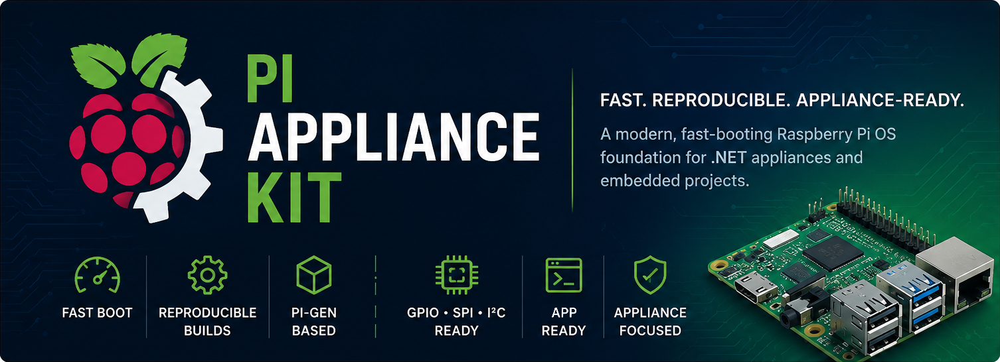

<p align="center">
  
</p>

# Pi Appliance Kit

A fast-boot, appliance-grade build of **Raspberry Pi OS Lite** for embedded
devices that run **exactly one daemon app**. Targets **Raspberry Pi 4**,
**Pi 3B+**, and **Pi Zero 2 W** (arm64).

On a stock Lite install, boot went from **31.96 s → 12.49 s** just by removing
`cloud-init` and friends. This project takes that further — and, crucially, makes
it **reproducible and distributable** so you (and the community) can rebuild it
on demand instead of hand-editing each device.

## Two ways to use it

| | For | How |
|---|---|---|
| **A. Prebuilt image** | New devices / the community | Flash the `.img.xz` from [Releases] with Raspberry Pi Imager |
| **B. Apply script** | Devices you already run | `sudo ./scripts/apply.sh` over SSH |

Both consume the **same source of truth**: [`config/optimizations.yaml`](config/optimizations.yaml).
Flip the toggles there; you never fork the logic.

[Releases]: ../../releases

## A. Flash the prebuilt image

1. Download the latest `pi-appliance-kit-*.img.xz` from the [Releases] page (verify with the `.sha256`).
2. In **Raspberry Pi Imager** → *Use custom* → select the file (or paste the release URL).
3. Flash and boot.

> **Imager's "Customisation" (OS settings) does not apply to custom images.**
> Raspberry Pi Imager only offers the WiFi / user / hostname / locale settings
> for its own catalog images — when you flash a custom `.img`, that step is
> skipped entirely. **Everything must be configured manually after first boot:**
>
> - **WiFi** — see [Setting up WiFi](#setting-up-wifi) below.
> - **User / password / hostname** — see
>   [Changing the username, hostname, or password](#changing-the-username-hostname-or-password).
> - **Region / time zone** — see
>   [Changing the region or time zone](#changing-the-region-or-time-zone).
>
> The image ships with a baked-in default identity and region so it boots and is
> reachable without any of this; the sections above are for changing those defaults.

The image ships with:
- **Read-only overlay root** — survives sudden power loss, no fsck, low SD wear.
- A **writable `/data` partition** (auto-created on first boot) for your app's config & data.
- A **pre-enabled `app.service`** + **`app-ready.target`** — the real "boot complete" marker.

## B. Apply to an existing device

```bash
git clone https://github.com/ctacke/Pi-Appliance-Kit
cd Pi-Appliance-Kit
sudo ./scripts/apply.sh --dry-run   # preview — changes nothing
sudo ./scripts/apply.sh             # apply, then reboot
```

Idempotent — safe to re-run. `--dry-run` prints every change first. (Read-only
root is delivered by the image; the script leaves an existing rootfs writable
unless you opt in — see the manifest.)

## Install your app

Your app is just **a directory containing an executable `run` entrypoint**
(a binary, or a script that starts your daemon). `run` is what gets launched on
boot; everything else in the directory (config, data, assets) comes along with it.

```
myapp/
├─ run            # executable — starts your daemon (chmod +x)
├─ config.toml    # your app's config, in whatever format you like
└─ ...            # binaries, assets, etc.
```

**You never edit `app.service` or run `systemctl enable`.** The service ships
**pre-enabled** and is guarded so it stays a harmless no-op until an app is
present — then it just runs it, and restarts it on every boot.

### Drop-in (default) — no rebuild

The app lives on the writable **`/data/app`** partition. From your workstation:

```bash
./scripts/install-app.sh ./myapp pi@device.local   # rsync + restart
```

Or copy it yourself and reboot:

```bash
rsync -a ./myapp/ pi@device.local:/data/app/        # (needs sudo rights on the Pi)
```

Run `./scripts/install-app.sh` with no host to install locally on the Pi.
Pass `--dry-run` to preview.

### Baked into the image (immutable fleets)

Put your app under **`overlay/opt/app/`** before building — it ships at
`/opt/app` inside the read-only image, and the same launcher finds it there.

### Where config & data go

Root is **read-only**. Your app reads/writes under **`/data`** (its home is
`/data/app`). Anything written elsewhere is discarded on power-off — that's the
point (power-loss resilience). Logs go to the journal, which is **volatile
(RAM)** by default, so if you need persistent logs, write them under `/data`.

```bash
journalctl -u app.service -f        # follow your app's output
```

### If your app needs extra system packages

The read-only root blocks `apt install`. Temporarily lift it, install, restore:

```bash
sudo raspi-config nonint disable_overlayfs && sudo reboot
# ... sudo apt-get install <pkgs> ...
sudo raspi-config nonint enable_overlayfs && sudo reboot
```

(Better for fleets: add the packages to `config/optimizations.yaml` `install:`
and rebuild the image so every device ships with them.)

### Changing the username, hostname, or password

> The image ships with a baked identity — user **`pi`**, hostname **`pi-appliance`**,
> and the password set at build time (currently set to `pi123!`). 

Because
the root **and** boot partitions are read-only, edits you make while the device is
running are held in a RAM overlay and **discarded on reboot** — so `passwd`,
`hostnamectl`, or editing `/etc/hostname` won't stick on their own.

To change them **persistently**, lift the overlay, edit, then restore it (same
procedure as installing packages above):

```bash
sudo raspi-config nonint disable_overlayfs && sudo reboot
# after reboot the root filesystem is writable:
sudo passwd pi                       # change the password
sudo hostnamectl set-hostname NEWNAME   # change the hostname
sudo nano /etc/hostname /etc/hosts   # (hostnamectl already updates these)
# to rename/add a user, edit it here too (e.g. `sudo usermod`, `sudo adduser`)
sudo raspi-config nonint enable_overlayfs && sudo reboot
```

After the final reboot the overlay is back on and your changes persist. `nano`
is included in the image for exactly this kind of on-device editing.

(For fleets, prefer rebuilding the image with new `hostname` / `PI_PASSWORD`
values in `.github/workflows/build-image.yml` so every device ships ready.)

### Setting up WiFi

WiFi must be set up manually after boot — Raspberry Pi Imager can't customize a
custom image (its OS-settings step is skipped for non-catalog `.img` files), and
this image removes NetworkManager (slow to boot, heavier than an appliance
needs), so `nmtui` and `nmcli` aren't available either. WiFi is brought up by
`wifi-late.service` **after** the boot-critical path.
Because the country code must be known before the radio will transmit, the image
ships with a default region — **US** — baked in (change it in
`config/optimizations.yaml`, `toggles.wifi_country`).

Pick whichever of these fits how you deploy:

**On the device (console or SSH over Ethernet):**

```bash
sudo wifi-setup                     # prompts for SSID + passphrase
# or non-interactively:
sudo wifi-setup "MySSID" "MyPassphrase"
sudo wifi-setup "MySSID" "MyPassphrase" GB   # ...with a different country
```

It writes the config, brings the link up, and waits for an IP — no reboot needed.

**Headless, with the SD card in a PC:** drop **one** of these onto the
`bootfs`/`boot` partition (the FAT one Windows/macOS can see). On first boot the
device consumes it, connects, then deletes it so credentials don't linger on the
readable partition:

- `wifi.conf` — simple key/value:
  ```ini
  SSID=MySSID
  PSK=MyPassphrase
  COUNTRY=US
  ```
- or a full `wpa_supplicant.conf`, if you already have one.

**Where credentials live:** `/data/wifi/wpa_supplicant.conf`. The root
filesystem is a read-only overlay, so WiFi config is stored on the writable
`/data` partition and survives reboots and power cuts. The passphrase is stored
as a hashed PSK, never plaintext.

**Troubleshooting** (`wlan0` stuck in state `DOWN`, or "no network adapters"):

```bash
systemctl status wifi-late.service   # did bring-up fail?
rfkill list wifi                     # "Soft blocked: yes" → country not set
wpa_cli -i wlan0 status              # association state
sudo systemctl restart wifi-late.service
```

### Changing the region or time zone

Both have build-time defaults in `config/optimizations.yaml`:

```yaml
toggles:
  wifi_country: US               # ISO 3166-1 alpha-2 — the WiFi regulatory domain
  timezone: America/Chicago      # tzdata name — US Central
```

The defaults are **US / US-Central**. Edit these and rebuild (or re-run
`scripts/apply.sh` on an existing device) to change the shipped defaults.

**Region (WiFi country):** on a running device, use `wifi-setup` with an explicit
country (`sudo wifi-setup "MySSID" "MyPass" GB`), or set it directly:

```bash
sudo raspi-config nonint do_wifi_country GB
sudo rfkill unblock wifi
sudo systemctl restart wifi-late.service
```

**Time zone:** `/etc/localtime` is a symlink baked into the read-only root, so a
plain `timedatectl set-timezone` won't stick across reboots. Lift the overlay
first (same procedure as changing the password above):

```bash
sudo raspi-config nonint disable_overlayfs && sudo reboot
# after reboot the root filesystem is writable:
sudo timedatectl set-timezone America/New_York   # `timedatectl list-timezones` to browse
sudo raspi-config nonint enable_overlayfs && sudo reboot
```

For fleets, prefer setting `timezone:` in the manifest and rebuilding so every
device ships correct.

### Measuring boot

`app.service` reaches `app-ready.target` — that's what boot time is measured
against, not generic login:

```bash
/usr/local/bin/boot-benchmark.sh    # appends to /data/boot-benchmark.log
```

## What it changes (and why)

- **Purges** `cloud-init` (~7 s), ModemManager, NetworkManager (→ `dhcpcd`), BlueZ.
- **Kernel/firmware**: `disable_splash`, `boot_delay=0`, audio & BT off, `quiet`, `fsck.mode=skip`.
  (On the Pi 3B+ and Zero 2 W, disabling Bluetooth is safe for WiFi — WiFi is on the SDIO bus, independent of the BT UART.)
- **Storage**: no swap, `journald` in RAM, read-only root removes fsck from the path.
- **Network/ssh off the critical path**: WiFi starts late; SSH via `ssh.socket` (on-demand, zero boot cost) instead of the metric-gaming "late" hack.
- **App-specific hardware** (e.g. SPI overlays) is kept **separate** from speed tweaks — set `hardware_overlays` in the manifest.

Full, tunable list: [`config/optimizations.yaml`](config/optimizations.yaml).

## Benchmarks

| Stage | Total | userspace | Notes |
|---|---|---|---|
| Stock Lite | 31.96 s | 26.22 s | cloud-init + NetworkManager dominate |
| Manual pass (notes.md) | 12.49 s | 7.38 s | cloud-init purged, NM→dhcpcd |
| Pi Appliance Kit | _TBD_ | _TBD_ | fill from `boot-benchmark.sh` on Pi 4 / 3B+ / Zero 2 W |

Fill the last row from real hardware and PR it.

## Contributing / customizing for your device

Edit `config/optimizations.yaml` toggles (keep WiFi? mDNS? read-only root? data
partition size?) and rebuild — no code changes needed. PRs welcome. MIT licensed.

## Repo layout

- `config/optimizations.yaml` — the single declarative manifest.
- `scripts/apply.sh` + `scripts/lib/` — Track B applier (dependency-free bash).
- `overlay/` — files baked into the image (`app.service`, `data.mount`, benchmark, …).
- `pi-gen/stage-appliance/` — Track A custom pi-gen stage (reuses `apply.sh`).
- `.github/workflows/build-image.yml` — CI: build `.img.xz` on tag → Release.
